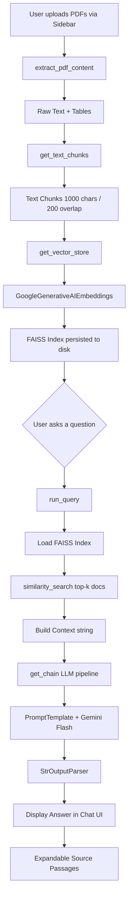

# AskMyPDF — Workflow & Execution Documentation

> **Project:** `AskMyPdf_Multi_PDF_ChatApp`  
> **Entry Point:** [chatapp.py](file:///c:/Users/Supriya/Downloads/AskMyPdf_Multi_PDF_ChatApp/chatapp.py)  
> **Author:** Shubham Vivek Reddy  
> **Live Demo:** https://askmypdf1.streamlit.app/

---

## 1. Project Overview

AskMyPDF is a **Streamlit-based Retrieval-Augmented Generation (RAG) chatbot** that allows users to upload multiple PDF documents and ask natural-language questions about them. It leverages Google Gemini for both embedding generation and answer synthesis, FAISS as a local vector store, and `pdfplumber` for rich PDF extraction (including tables).

---

## 2. Technology Stack

| Layer | Library / Service | Role |
|---|---|---|
| **UI** | `streamlit` | Web interface, sidebar, widgets |
| **PDF Parsing** | `pdfplumber`, `PyPDF2` | Text & table extraction from PDFs |
| **Text Splitting** | `langchain_text_splitters` → `RecursiveCharacterTextSplitter` | Chunk raw text into overlapping segments |
| **Embeddings** | `langchain_google_genai` → `GoogleGenerativeAIEmbeddings` (`gemini-embedding-001`) | Convert text chunks to vector embeddings |
| **Vector Store** | `langchain_community` → `FAISS` | Persist & query embeddings locally |
| **LLM** | `langchain_google_genai` → `ChatGoogleGenerativeAI` (`gemini-2.5-flash`) | Generate natural-language answers |
| **Prompt Chaining** | `langchain_core` → `PromptTemplate` + `StrOutputParser` | Build structured LLM chain |
| **Data Handling** | `pandas`, `numpy` | Clean and display extracted tables |
| **Config** | `python-dotenv` | Load `GOOGLE_API_KEY` from [.env](file:///c:/Users/Supriya/Downloads/AskMyPdf_Multi_PDF_ChatApp/.env) |

---

## 3. Project File Structure

```
AskMyPdf_Multi_PDF_ChatApp/
├── chatapp.py            ← Single-file application (entry point)
├── requirements.txt      ← Python dependencies
├── .env                  ← API key storage (GOOGLE_API_KEY)
├── faiss_index/          ← Auto-generated FAISS vector index (persisted to disk)
├── docs/                 ← Supporting documentation assets
├── img/                  ← Architecture & demo screenshots
├── .devcontainer/        ← Dev container configuration
├── .gitignore
└── README.md
```

---

## 4. High-Level Architecture



---

## 5. Execution Steps — Detailed Walkthrough

### Phase 1: Application Startup

1. **Environment Loading** (`load_dotenv()`, line 16)  
   - Reads `GOOGLE_API_KEY` from the [.env](file:///c:/Users/Supriya/Downloads/AskMyPdf_Multi_PDF_ChatApp/.env) file into `os.environ`.

2. **Streamlit Page Config** (`st.set_page_config`, line 19)  
   - Sets page title `"AskMyPDF"`, icon `"✦"`, and wide layout.

3. **CSS Injection** (lines 22–347)  
   - Injects Google Fonts (Cormorant Garamond + DM Sans).
   - Applies a dark-mode custom design system (background `#0A0A0A`, gold accent `#C9A96E`).
   - Styles: sidebar, file uploader, chat bubbles, source cards, footer, scrollbar, animations.

---

### Phase 2: PDF Upload & Processing (Sidebar)

```
User → Sidebar → Upload PDFs → Click "Analyse Documents"
```

4. **Sidebar Rendering** (lines 459–492)
   - Displays branding and a `st.file_uploader` that accepts multiple `.pdf` files.
   - Lists each uploaded filename under the uploader.

5. **"Analyse Documents" Button Click** (lines 470–489)
   - Checks if files are uploaded; warns otherwise.
   - Calls [extract_pdf_content(pdf_docs)](file:///c:/Users/Supriya/Downloads/AskMyPdf_Multi_PDF_ChatApp/chatapp.py#380-397) → returns [(raw_text, tables)](file:///c:/Users/Supriya/Downloads/AskMyPdf_Multi_PDF_ChatApp/chatapp.py#422-456).
   - If no content found, stops with a warning.
   - Calls [get_text_chunks(raw_text)](file:///c:/Users/Supriya/Downloads/AskMyPdf_Multi_PDF_ChatApp/chatapp.py#398-401) → returns list of string chunks.
   - Calls [get_vector_store(chunks)](file:///c:/Users/Supriya/Downloads/AskMyPdf_Multi_PDF_ChatApp/chatapp.py#402-409) → embeds and saves FAISS index.
   - On success: stores `extracted_text`, `extracted_tables`, and `processed = True` in `st.session_state`.

---

### Phase 3: Core Helper Functions

#### [extract_pdf_content(pdf_docs)](file:///c:/Users/Supriya/Downloads/AskMyPdf_Multi_PDF_ChatApp/chatapp.py#380-397) — Lines 380–396
```
For each PDF:
  Open with pdfplumber
  ├── For each page:
  │   ├── Extract plain text → append to text_content
  │   └── Extract tables → clean with clean_table_data() → append to tables_content
  └── Return (text_content, tables_content)
```
- Uses `pdfplumber.open()` for both text and table extraction.
- Handles errors per-file gracefully with `st.error`.

#### [clean_table_data(table)](file:///c:/Users/Supriya/Downloads/AskMyPdf_Multi_PDF_ChatApp/chatapp.py#352-379) — Lines 352–378
```
Raw table (list of lists)
  → Create DataFrame
  → Detect & remove duplicate header row
  → Deduplicate column names (Col_0, Col_1...)
  → Replace empty/null cells with NaN
  → Drop all-NaN rows and columns
  → Return cleaned DataFrame
```
- Handles edge cases: empty tables, `None` cells, duplicate headers.

#### [get_text_chunks(text)](file:///c:/Users/Supriya/Downloads/AskMyPdf_Multi_PDF_ChatApp/chatapp.py#398-401) — Lines 398–400
```
Raw text string
  → RecursiveCharacterTextSplitter(chunk_size=1000, chunk_overlap=200)
  → Returns list of overlapping text chunks
```
- Overlap of 200 characters preserves context across chunk boundaries.

#### [get_vector_store(text_chunks)](file:///c:/Users/Supriya/Downloads/AskMyPdf_Multi_PDF_ChatApp/chatapp.py#402-409) — Lines 402–408
```
Text chunks list
  → GoogleGenerativeAIEmbeddings(model="gemini-embedding-001")
  → FAISS.from_texts(chunks, embeddings)
  → Save index to local directory "faiss_index/"
```
- The FAISS index is **persisted to disk** and reloaded on each query.

#### [get_chain()](file:///c:/Users/Supriya/Downloads/AskMyPdf_Multi_PDF_ChatApp/chatapp.py#410-421) — Lines 410–420
```
Builds a LangChain LCEL pipeline:
  PromptTemplate(context + question)
  → ChatGoogleGenerativeAI(gemini-2.5-flash, temperature=0.3)
  → StrOutputParser()
```
- Temperature `0.3` gives mostly deterministic, factual answers.
- Prompt instructs the model to answer only from the provided context and say *"Answer not available"* if it cannot.

#### [run_query(user_question)](file:///c:/Users/Supriya/Downloads/AskMyPdf_Multi_PDF_ChatApp/chatapp.py#422-456) — Lines 422–455
```
User question (string)
  → Load FAISS index from disk
  → similarity_search(user_question) → top-4 relevant chunks
  → Join chunks into context string
  → get_chain().invoke({context, question})
  → Render chat bubbles (user + bot) via HTML
  → Show expandable "View source passages" (top 2 chunks, 400 chars each)
```

---

### Phase 4: Main Area Rendering

6. **Status Badge** (lines 496–514)
   - Displays green pulsing dot if `processed = True`, grey dot otherwise.
   - Shows status text: *"Upload documents from the sidebar to begin"* or *"Documents ready · Ask a question below"*.

7. **Extracted Content Preview** (lines 516–539)  
   Shown only when `processed = True`:
   - **📄 View extracted text** — collapsible `st.text_area` showing raw text.
   - **📊 View extracted tables** — collapsible `st.dataframe` for each extracted table.

8. **Question Input** (lines 541–555)
   - `st.text_input` with placeholder text.
   - On any non-empty input, calls [run_query(user_question)](file:///c:/Users/Supriya/Downloads/AskMyPdf_Multi_PDF_ChatApp/chatapp.py#422-456) immediately.

9. **Footer** (lines 557–563)
   - Displays attribution link at the bottom.

---

## 6. Session State Variables

| Key | Type | Purpose |
|---|---|---|
| `processed` | `bool` | Whether PDFs have been successfully processed |
| `extracted_text` | `str` | Raw concatenated text from all PDFs |
| `extracted_tables` | `list[DataFrame]` | Cleaned tables extracted from all PDFs |

---

## 7. Data Flow Summary

```
PDF Files
  ↓ pdfplumber
Text + Tables
  ↓ RecursiveCharacterTextSplitter (1000/200)
Text Chunks
  ↓ gemini-embedding-001
Vector Embeddings
  ↓ FAISS (saved to faiss_index/)
Vector Index
  ↑ User Question → similarity_search → Top-K Chunks
  ↓ Context + Question → PromptTemplate
LLM Chain (gemini-2.5-flash)
  ↓ StrOutputParser
Answer String → Streamlit Chat UI
```

---

## 8. Setup & Execution Instructions

### Prerequisites
- Python 3.8+
- A Google API Key with Gemini access

### Step-by-Step Setup

```bash
# 1. Clone the repository
git clone https://github.com/shubhamr9172/AskMyPDF---AI-Chatbot.git
cd AskMyPDF---AI-Chatbot

# 2. Install dependencies
pip install -r requirements.txt

# 3. Configure API key — create .env file
echo "GOOGLE_API_KEY=your_key_here" > .env

# 4. Run the application
streamlit run chatapp.py
```

> [!NOTE]
> The app runs on `http://localhost:8501` by default. The `faiss_index/` directory is created automatically on first document processing.

---

## 9. Key Design Decisions

| Decision | Rationale |
|---|---|
| `pdfplumber` over `PyPDF2` | Better table extraction; `PyPDF2` is imported but not actively used |
| FAISS local persistence | Avoids re-embedding on each question; survives page refreshes |
| `chunk_overlap=200` | Preserves sentence boundaries across chunk splits |
| `temperature=0.3` | Balances accuracy with readability for factual Q&A |
| Single-file app ([chatapp.py](file:///c:/Users/Supriya/Downloads/AskMyPdf_Multi_PDF_ChatApp/chatapp.py)) | Simplifies deployment; appropriate for a focused utility app |
| Session state for content | Prevents re-processing PDFs on every Streamlit re-render |

---

## 10. Limitations & Potential Improvements

| Limitation | Suggested Improvement |
|---|---|
| No chat history / memory | Add `st.session_state['chat_history']` and include in prompt context |
| `PyPDF2` imported but unused | Remove unused import |
| Single index (overwritten on re-upload) | Support named indices per document set |
| Tables not embedded into FAISS | Serialize table content as text and embed alongside PDF text |
| No streaming response | Use `stream=True` with Gemini for progressive token rendering |
| No authentication | Add Streamlit login for multi-user deployments |
